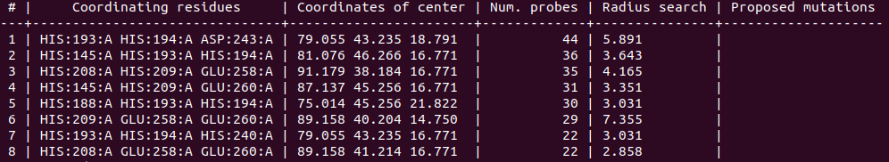
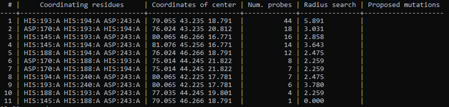
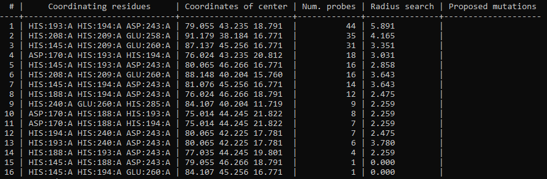
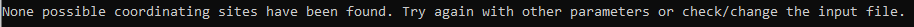
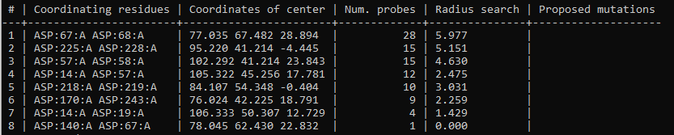
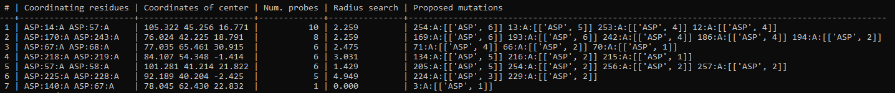

.. _tutorial1:

==========================================
Learning how a BioMetAll calculation works
==========================================

Objectives
==========

In this first tutorial, the goal is to understand all the options that BioMetAll has to personalize a calculation.

The only mandatory input for a BioMetAll calculation is a structure of the biological system that will be object of study. It can be provided in a `.pdb` file or by indicating its 4-character PDB code. In the latter case, the structure will be downloaded from the Protein Data Bank and saved in a *xxxx.pdb* file on the working directory.

.. tip::

    `BioMetAll` can handle files with several chains, but if you are interested specifically in one/several of them, removing the non useful chains in your `.pdb` file is recommended.

Along this use case tutorial, the chain A of the PDB code 1dhy (`KKS102 BPHC enzyme`) will be used.

1. Executing the program with default parameters
================================================

To execute the exploration of possible metal-binding zones, you simply should call the executable of `BioMetAll` followed by the `.pdb` file path or the 4-character PDB code:

::

    biometall <path/to/the/input_file.pdb>

    or
 
    biometall 1dhy 

You will obtain a list of solutions (i.e. the possible coordinating environments), followed by the coordinates of the center of the area, its radius and the number of probes which match the coordination criteria. In the case of **1dhy**, 39 solutions are obtained, being the first one an area formed by 44 probes.

- The results of the execution will be shown on the screen and saved in a `results_biometall_1dhy.txt` file in the working directory.
- The different coordinating environments will be ordered by number of probes that match that environment. 
- If one probe matches several coordinating environments (e.g. [HIS:145:A HIS:193:A HIS:194:A ASP:243:A] and [HIS:193:A HIS:194:A ASP:243:A]), that probe is accounted in all the environments it matches.
- The center and radius provided for each solution defines the minimum sphere which contains all the probes of that solution.

In addition to the `.txt` results file, you can obtain a `.pdb` file containing the different coordination areas with their corresponding centers. To do so, you should use the `--pdb` parameter:

::

    biometall --pdb 1dhy

It will output a `probes_1dhy.pdb` that you can open together with your original `.pdb` file in any visualization program:

.. image:: images/tutorial1_movie3.gif
    :align: center
    :alt: Movie

Every solution is stored as Xeon atoms (probes, depicted in green) and a Helium atom (center of each coordinating environment, depicted in yellow). Each solution is stored as a different residue in the `probes_1dhy.pdb` file, so you can easily see which probes corresponds to each one. For example, for the first coordinating environment (probes in green and center in yellow sphere):

.. image:: images/tutorial1_movie2.gif
    :align: center
    :alt: Movie

2. Executing with custom parameters
===================================

**2.1. Filtering the results by number of probes (`--cutoff`)**

By default, the program proposes as solutions all the coordinating environments. If you want to obtain solutions only with a high number of probes (i.e. wide areas where the metal could coordinate), you should use the `cutoff` parameter. For example, you can use a `cutoff` of 0.5 to obtain solutions with a number of probes >= half of the probes of the solution with highest number. In the `1dhy` example, only solutions with number of probes >= 22 will be provided:

::

        biometall --cutoff 0.5 1dhy

    
- To show solutions with a number of probes higher than 40% of the highest scored:

::

 biometall --cutoff 0.4 idhy
    

**2.2. Customizing which amino acids are considered as possible coordinators (`--residues`)**

By default, the list of amino acids that are considered as potential metal coordinators is:

::
    ASP, HIS, GLU, CYS
    

You can modify this list using the `--residues` parameter. You should indicate the amino acids in their 3-letter code, enclosed between brackets `[]` and separated by commas (without spaces). For example, to search for coordinating environments formed by a (much) more extended set of amino acids, you could type:

::

        biometall --pdb --residues [ASN,ASP,CYS,GLN,GLU,HIS,MET,SER,THR,TYR] 1dhy
    
.. image:: images/tutorial1_movie1.gif
    :align: center
    :alt: Result of the execution

**2.3. Obtaining solutions with a minimum of coordinating amino acids (`--min_coordinators`)**

By default, coordinating environments with a minimum of **three amino acids** are considered as valid solutions. If you want to change this number, it can be done with the `--min_coordinators` parameter.
  
- To show coordinating environments with a minimum of four amino acids:

::

        biometall --pdb --min_coordinators 4 --residues [ASN,ASP,CYS,GLN,GLU,HIS,MET,SER,THR,TYR] 1dhy

.. image:: images/tutorial1_movie4.gif
    :align: center
    :alt: Result of the execution

**2.4. Adding solutions that match backbone oxygen atoms (`--backbone`)**

The usual case when searching metal-coordinating amino acids is to search for atoms of their side chains, and that is the default in `BioMetAll` calculations. However, in some cases could be useful to consider coordinations with backbone oxygens. To do so, you should use the `--backbone` parameter, followed by a list of the amino acids that you consider potential coordinators in their bakcbone. You should indicate the amino acids in their 3-letter code, enclosed between brackets `[]` and separated by commas (without spaces). Also, you can indicate the word `ALL` if you want to consider coordination with backbone oxygen of all amino acids. 

For example, to consider coordinations with backbone oxygens of histidines besides the standard side chains coordinations, you should type:
   
::

        biometall --backbone [HIS] 1dhy
    
To consider coordinations with backbone oxygens of all amino acids and a minimum of four coordinators:

::

        biometall --min_coordinators 4 --backbone ALL --residues [ASN,ASP,CYS,GLN,GLU,HIS,MET,SER,THR,TYR] 1dhy

.. image:: images/tutorial1_movie5.gif
    :align: center
    :alt: Result of the execution

.. warning::

    In this latter example, the minimum of coordinators refers to the sum of sidechains and backbone coordinations detected. An amino acid is counted double if it can be coordinated both by a sidechain atom and a backbone atom.

**2.5. Defining a more dense (or scattered) grid (`--grid`)**

`BioMetAll` defines a grid of points (i.e. probes) containing all the volume of your system. Each point of the grid is tested to see if it can be part of a coordinating environment. By default, points of the grid are generated with a separation of 1.0 Angstroms, but if you want a greater (or lower) detail, you can modify it using the `--grid` parameter. For example, to generate a grid with a separation of 0.5 Angstroms between probes:

::

        biometall --grid 0.5 1dhy

.. warning::

    `grid` parameter has direct implication in the computational time required to perform the calculation. It affects specially when `--mutations` option is used.

**2.6. Defining a search zone (`--center` and `--radius`)**

By default, the grid of probes is constructed to embed the whole system. If you have an specific zone that you want to search, it can be defined using the `--center` (for the center of coordinates of the zone) and `--radius` parameters. The coordinates should be enclosed between brackets `[]` and separated by commas (without spaces). For example:

::

        biometall --center [84.98,42.82,16.04] --radius 10.0 1dhy

**2.7. Defining how many processors are used for the calculation  (`--cores`)**

By default, `BioMetAll` calculations are run in a parallel mode using all the physical cores available in your computer. If for some reason (e.g. you are running `BioMetAll` in a cluster of computers) you want to change it, you can use the `--cores` parameters to define how many physical cores will be used. For example, to use two cores:

::

        biometall --cores 2 1dhy

3. Searching for a specific motif
=================================

In addition to searching a list of possible coordinating amino acids with the --residues option, there exists also the possiblity to search for a specific motif. The syntax offers two options: search for an exact motif and search for a variable motif.

To search for an exact motif, you must enclose the motif in square brackets `[]`. The 3-letter code for the amino acids that make up the motif must be separated with commas (without spaces). For example, to search for motifs composed of two histidines and one asparte, you would use:

::

        biometall --motif [HIS,HIS,ASP] 1dhy
    

The second option is to introduce some variability using the forward slash symbol `/`. It is used to indicate that a residue of the motif has several alternatives. For example, you could search for motifs composed of two histidines and either an aspartate or a glutamate with the following command:

::

        biometall --motif [HIS,HIS,ASP/GLU] 1dhy

.. tip::

    You can use slash notation in more than one position of the motif. Also, more than two options are allowed in each position. For example, [HIS/CYS,HIS,ASP/GLU/TYR] would represent a motif where one position should be either a histidine or a cysteine, another position should be a histidine, and the other position either an aspartate, a glutamate or a tyrosine. 

4. Proposing mutations to complete a motif
==========================================

BioMetAll can be used as a tool to start the design of a metal binding site by proposing mutations to complete an incipient binding site already present in the protein.

As an illustrative case we can continue with the example of the protein with PDB code 1dhy. It can be seen that, among the binding sites with three coordinating residues, there is none formed by three aspartates:

::

        biometall --motif [ASP,ASP,ASP] 1dhy

However, there are eight possible binding sites with two coordinating aspartates:

::

        biometall --motif [ASP,ASP] 1dhy

A design exercise could be to find the options to complete these ASP,ASP motifs with another aspartate to form a triad. This is done with the combination of the --motif and --mutations options. In the `motif` option we will indicate the incipient motif already present in the protein (in this case ASP,ASP). In the `mutations` option, we will indicate the amino acid/s necessary to complete the desired motif (in this case, another ASP to complete the triad). The command will be the following:

::
     
        biometall --motif [ASP,ASP] --mutations [ASP] 1dhy
        

The result shows that seven of the eight ASP,ASP motifs could be completed to achieve the aspartate triad. The different mutation options are listed in the "proposed mutations" column, along with the number of probes of each option. As indicated in the BioMetAll article (benchmark and case study 3), the number of probes can be used to prioritize the solutions, in this case being the most favourable ones:
    
    i) the mutation of residue 254 to aspartate, forming the triad ASP14,ASP57,ASP254
    
    ii) the mutation of residue 169 to aspartate, forming the triad ASP170,ASP243,ASP169
    
    iii) the mutation of residue 193 to aspartate, forming the triad ASP170,ASP243,ASP193. 
    
However, you should note that BioMetAll does not consider energetic terms, so the other solutions cannot be discarded beforehand.
  
.. tip::

    As with motif searches, you can use forward slash notation to incorporate some variability in your search. The notation can be used in the `motif` or `mutations` options, or in both options at the same time. However, you should be aware that the interpretation of the results will increase in complexity with the variability of the search.
